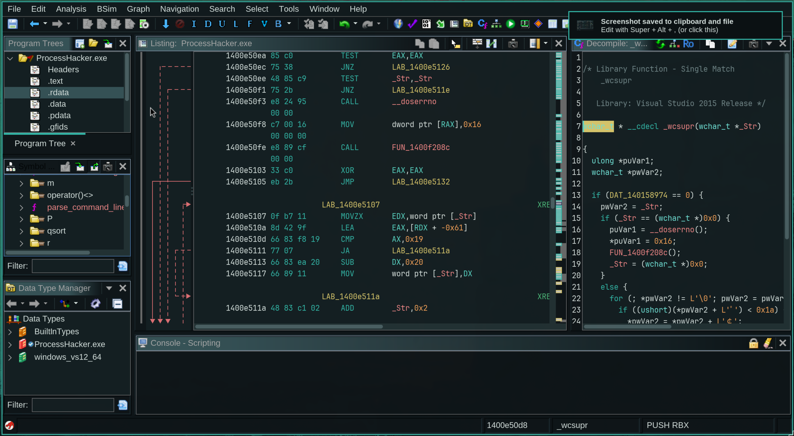

# Leenium Ghidra

**A dark Ghidra theme built from the shared Leenium palette, inspired by the Catppuccin Mocha Ghidra theme and tuned to match the Leenium editor and Neovim colors.**

Hosted under `github.com/drunkleen/leenium.ghidra`.

---

## Features

- **Leenium-aligned** - matches the same neutral, accent, and semantic language used by the rest of the ecosystem
- **Decompiler coverage** - tuned for comments, constants, functions, keywords, types, and variables
- **Listing coverage** - includes xrefs, labels, mnemonics, registers, flow arrows, and selection states
- **UI coverage** - headers, toolbars, filter fields, tooltip surfaces, and selection backgrounds are styled
- **Mocha-inspired structure** - follows the Catppuccin Ghidra theme layout, but with Leenium values

---

## Install

1. Open Ghidra.
2. Go to **Edit** > **Theme** > **Import...**.
3. Select `leenium.theme`.
4. Enjoy.

---

## Use

This theme is intended to feel like the Leenium editor stack inside Ghidra:

- same background depth as VS Code and Neovim
- same teal and cyan accent language
- same selection state and muted border treatment

---

## The Leenium Ecosystem

Leenium is a unified dark desktop environment built around the same color palette. Alongside this Waybar theme, the project ships matching configs for:

- [**Firefox**](github.com/drunkleen/leenium.firefox) - browser theme extension
- [**Hyprlock**](github.com/drunkleen/leenium.hyprlock) - hyprland lockscreen
- [**Limine**](github.com/drunkleen/leenium.limine) - BootLoader
- [**Neovim**](github.com/drunkleen/leenium.nvim) - syntax highlights and UI elements
- [**Omarchy**](github.com/drunkleen/leenium.omarchy) - desktop theme bundle
- [**OpenCode**](github.com/drunkleen/leenium.opencode) - terminal-first theme
- [**VS Code**](github.com/drunkleen/leenium.vscode) - editor theme and UI palette
- [**Waybar**](github.com/drunkleen/leenium.waybar) - editor theme and UI palette

Visit [github.com/drunkleen](https://github.com/drunkleen) or [leenium.drunkleen.com](https://leenium.drunkleen.com/) to explore the full setup.

---

## License

MIT © [Leenium](LICENSE)

MIT © [Leenium](LICENSE)
